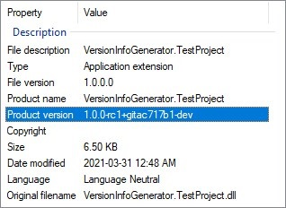

# VersionInfoGenerator

[](https://www.nuget.org/packages/VersionInfoGenerator)
[](LICENSE)

A .NET library that makes csproj version information (including git state) available at runtime and compile time.

Compliant with [SemVer 2.0.0](https://semver.org)

# How to use

In your `.csproj`:

```xml
<PropertyGroup>
  <Version>1.0.0</Version> <!-- Major.Minor.Patch -->
  <VersionPrerelease>rc1</VersionPrerelease> <!-- (Optional) for prereleases: 1.0.0-rc1 -->
</PropertyGroup>

<ItemGroup>
  <PackageReference Include="VersionInfoGenerator" Version="1.1.0" PrivateAssets="all" />
</ItemGroup>
```

Output:



```cs
internal static class VersionInfo
{
    public const string RootNamespace = "VersionInfoGenerator.TestProject";
    public const string Version = "1.0.0";
    public const string VersionPrerelease = "rc1";
    public const string VersionMetadata = "gitac717b1-master";
    public const string SemVer = "1.0.0-rc1+gitac717b1-master";
    public const string GitRevShort = "ac717b1";
    public const string GitRevLong = "ac717b1885cd0f984cabe77dd5f37c9200795298";
    public const string GitBranch = "master";
    public const string GitTag = "v1.0.0";
    public const bool GitIsDirty = false;
}
```

# Settings

```xml
<PropertyGroup>
  <!-- Major.Minor.Patch -->
  <Version>1.0.0</Version>
  <!-- The SemVer prerelease tag -->
  <VersionPrerelease>rc1</VersionPrerelease>
  <!-- If specified, it replaces the default SemVer metadata format -->
  <!-- default: git$(GitRevShort)-$(GitBranch) -->
  <VersionMetadata>@@GitRevShort@@</VersionMetadata>
  <!-- The name of generated class (defaults to VersionInfo) -->
  <VersionInfoClassName></VersionInfoClassName>
  <!-- The namespace to use for the VersionInfo class -->
  <VersionInfoNamespace></VersionInfoNamespace>
  <!-- The modifiers of the VersionInfo class -->
  <VersionInfoClassModifiers>internal static</VersionInfoClassModifiers>
  <!-- Controls whether to generate the VersionInfo class -->
  <VersionInfoGenerateClass>true</VersionInfoGenerateClass>
  <!-- Controls what properties to include in the VersionInfo class -->
  <VersionInfoSerializedProperties>RootNamespace;Version;VersionPrerelease;VersionMetadata;SemVer;GitRevShort;GitRevLong;GitBranch;GitTag;GitIsDirty</VersionInfoSerializedProperties>
  <!-- Controls whether to append VersionMetadata to the SemVer property -->
  <UseVersionMetadata>true</UseVersionMetadata>
  <!-- Controls whether to override AssemblyVersion, FileVersion and InformationalVersion -->
  <OverrideProjectVersion>true</OverrideProjectVersion>
</PropertyGroup>
```

A config file (named `VersionInfoGenerator.Config.props`) can be created to gain more control over the MSBuild properties, e.g.:

```xml
<Project>
  <PropertyGroup>
    <GitBinary>/path/to/git</GitBinary>
  </PropertyGroup>

  <Target Name="VersionInfoConfig" AfterTargets="GetGitInfo">
    <PropertyGroup Condition="'$(GitBranch)' == 'master'">
      <VersionMetadata>$(VersionMetadata)-RELEASE</VersionMetadata>
    </PropertyGroup>
  </Target>
</Project>
```

## Special variable substitution

Special variables can be used to customize the SemVer metadata (as an alternative to `VersionInfoGenerator.Config.props`):

- `@@GitRevShort@@`: the 7-character hash of the current commit (suffixed with `-dirty` if there's uncommited changes)
- `@@GitRevLong@@`: the full hash of the current commit (suffixed with `-dirty` if there's uncommited changes)
- `@@GitBranch@@`: the current git branch
- `@@GitTag@@`: the current git tag
- `@@VersionMetadata@`: the default VersionMetadata format (`git@@GitRevShort@@-@@GitBranch@@`)
